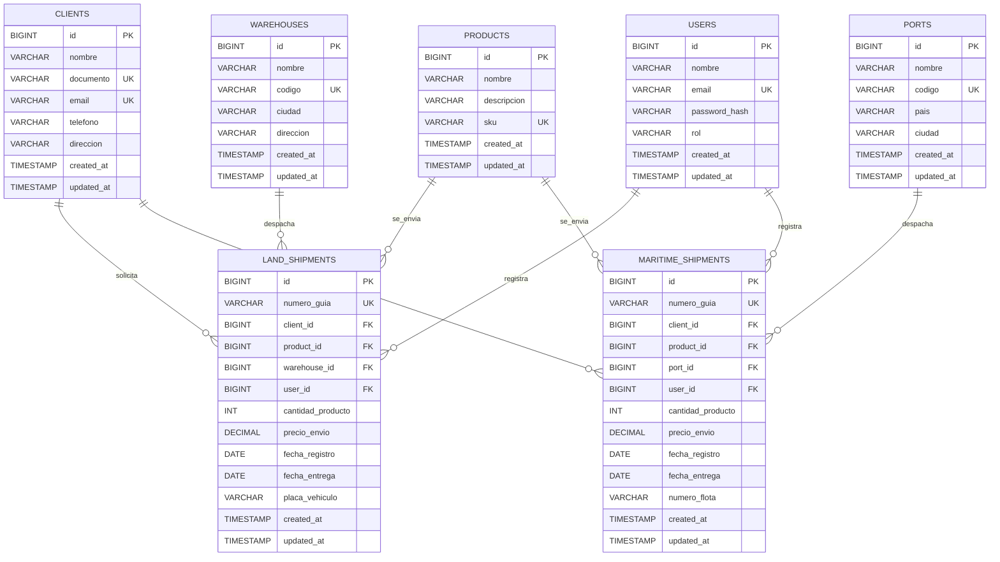

# Diagrama E-R

```mermaid
erDiagram
  CLIENTS {
    BIGINT id PK
    VARCHAR nombre
    VARCHAR documento UK
    VARCHAR email UK
    VARCHAR telefono
    VARCHAR direccion
    TIMESTAMP created_at
    TIMESTAMP updated_at
  }

  PRODUCTS {
    BIGINT id PK
    VARCHAR nombre
    VARCHAR descripcion
    VARCHAR sku UK
    TIMESTAMP created_at
    TIMESTAMP updated_at
  }

  WAREHOUSES {
    BIGINT id PK
    VARCHAR nombre
    VARCHAR codigo UK
    VARCHAR ciudad
    VARCHAR direccion
    TIMESTAMP created_at
    TIMESTAMP updated_at
  }

  PORTS {
    BIGINT id PK
    VARCHAR nombre
    VARCHAR codigo UK
    VARCHAR pais
    VARCHAR ciudad
    TIMESTAMP created_at
    TIMESTAMP updated_at
  }

  USERS {
    BIGINT id PK
    VARCHAR nombre
    VARCHAR email UK
    VARCHAR password_hash
    VARCHAR rol
    TIMESTAMP created_at
    TIMESTAMP updated_at
  }

  LAND_SHIPMENTS {
    BIGINT id PK
    VARCHAR numero_guia UK
    BIGINT client_id FK
    BIGINT product_id FK
    BIGINT warehouse_id FK
    BIGINT user_id FK
    INT cantidad_producto
    DECIMAL precio_envio
    DATE fecha_registro
    DATE fecha_entrega
    VARCHAR placa_vehiculo
    TIMESTAMP created_at
    TIMESTAMP updated_at
  }

  MARITIME_SHIPMENTS {
    BIGINT id PK
    VARCHAR numero_guia UK
    BIGINT client_id FK
    BIGINT product_id FK
    BIGINT port_id FK
    BIGINT user_id FK
    INT cantidad_producto
    DECIMAL precio_envio
    DATE fecha_registro
    DATE fecha_entrega
    VARCHAR numero_flota
    TIMESTAMP created_at
    TIMESTAMP updated_at
  }

  CLIENTS ||--o{ LAND_SHIPMENTS : "solicita"
  PRODUCTS ||--o{ LAND_SHIPMENTS : "se_envia"
  WAREHOUSES ||--o{ LAND_SHIPMENTS : "despacha"
  USERS ||--o{ LAND_SHIPMENTS : "registra"

  CLIENTS ||--o{ MARITIME_SHIPMENTS : "solicita"
  PRODUCTS ||--o{ MARITIME_SHIPMENTS : "se_envia"
  PORTS ||--o{ MARITIME_SHIPMENTS : "despacha"
  USERS ||--o{ MARITIME_SHIPMENTS : "registra"
```
